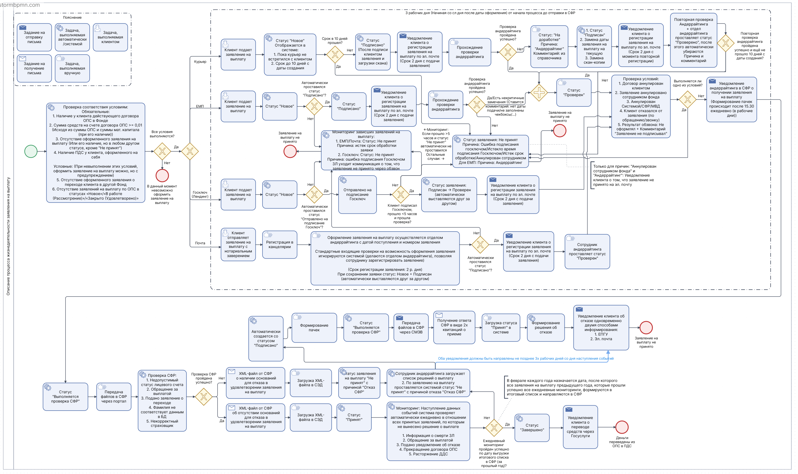

# Алгоритм обработки заявления на единовременную выплату (ЗЕВ)

## Описание артефакта
Структурированная блок-схема, описывающая полный алгоритм обработки заявления клиента на единовременную выплату средств пенсионных накоплений в крупном российском НПФ.

Схема отражает все этапы: от проверки условий до финального статуса заявления и взаимодействия с государственными органами.

## Контекст
Процесс разработан для **крупного российского негосударственного пенсионного фонда (НПФ)** и отражает реальную бизнес-логику, включая интеграцию с СФР (Социальным фондом России) и государственными системами (ЕПГУ, СМЭВ).

## Что отражено на схеме

**1. Предварительные проверки (на этапе подачи):**
- Наличие действующего договора ОПС
- Положительный баланс на счете (≥ 0,01)
- Отсутствие активных заявлений на выплату
- Наличие оформленного ПДС (программа долгосрочных сбережений)

**2. Условия и ветвления:**
- Если **все обязательные условия** соблюдены → заявление принимается
- Если **обязательные условия** нарушены → оформление невозможно
- Если нарушены **предупредительные условия** → заявление принимается с уведомлением клиента

**3. Каналы подачи заявления:**
- Курьерская доставка
- Единый портал госуслуг (ЕПГУ)
- Госключ (криптоподпись)
- Почта России (с нотариальным заверением)

**4. Жизненный цикл заявки (статусы):**
- **Новое** → зарегистрировано в системе
- **Подписано** → клиент подтвердил заявление
- **Проверяется** → андеррайтинг и верификация
- **Выполняется проверка СФР** → направлено в госорган
- **Принято / Не принято** → финальное решение
- **Завершено** → выплата исполнена

**5. Взаимодействие с государственными системами:**
- Передача данных в СФР через СМЭВ 3
- Получение XML-ответов о наличии/отсутствии оснований для отказа
- Ежедневный мониторинг принятых заявлений до даты формирования итогового списка

## Формат
Схема выполнена в виде структурированного алгоритма (блок-схема), наглядно демонстрирующего логику принятия решений и потоки данных.

## Файл

## Ценность для бизнеса
- Позволяет быстро понять логику выплатного процесса
- Служит основой для разработки технического задания
- Может использоваться для обучения новых сотрудников
- Демонстрирует комплексный подход с учётом госрегулирования
