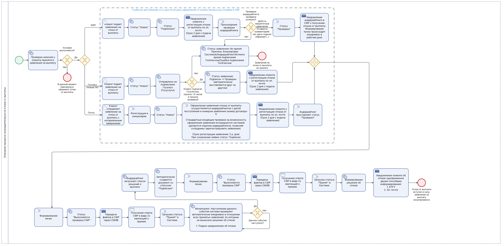

# Алгоритм обработки заявления об отказе от выплаты (ЗЕВО)

## Описание артефакта
Структурированная блок-схема, описывающая алгоритм подачи и обработки заявления клиента об отказе от ранее принятого решения о единовременной выплате в крупном российском НПФ.

## Контекст
Процесс разработан для **крупного российского негосударственного пенсионного фонда (НПФ)** и является логическим продолжением процесса ЗЕВ. Если клиент передумал получать выплату, он может подать заявление об отказе — схема описывает полную логику аннулирования предыдущего решения.

## Что отражено на схеме

**1. Предварительная проверка:**
- Наличие у клиента действующего и принятого заявления на выплату (ЗЕВ)

**2. Каналы подачи заявления об отказе:**
- Единый портал госуслуг (ЕПГУ)
- Госключ (криптоподпись)
- Почта России (с нотариальным заверением)

**3. Жизненный цикл заявки об отказе:**
- **Новое** → зарегистрировано в системе
- **Подписано** → клиент подтвердил отказ
- **Проверяется** → андеррайтинг и валидация
- **Передано в СФР** → направлено в госорган
- **Обработано** → финальное решение

**4. Ключевые этапы:**
- Проверка андеррайтинга
- Формирование пачек и отправка в СФР
- Обработка мониторинга: ожидание уведомления об отказе
- После подтверждения — создание итогового решения (ОПЕВ)
- Уведомление клиента по двум каналам: ЕПГУ и электронная почта

**5. Особенность процесса:**
Система автоматически проверяет, подано ли клиентом уведомление об отказе. Только после этого запускается финальная стадия — аннулирование ЗЕВ и выпуск решения (ОПЕВ).

## Формат
Схема выполнена в виде структурированного алгоритма (блок-схема).

## Файл

## Ценность для бизнеса
- Реализует юридически значимый процесс отказа
- Полностью автоматизирует взаимодействие с госорганами
- Обеспечивает прозрачность для клиента и аудит
- Поддерживает различные каналы подачи
